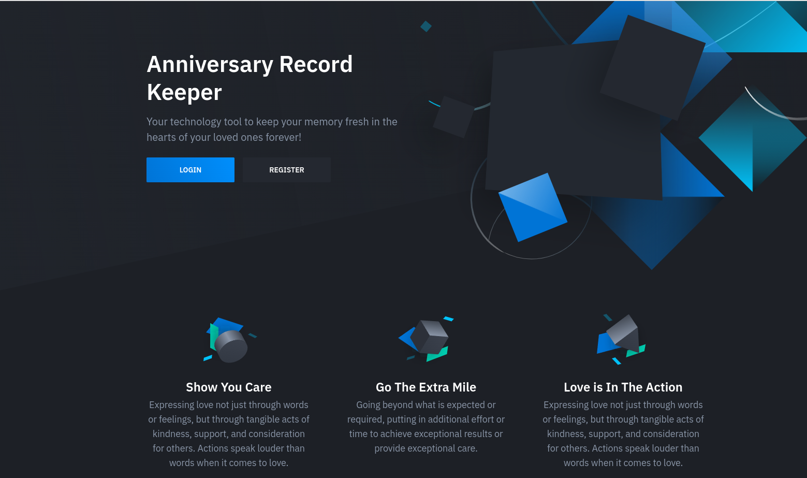

<p align="center"><a href="https://myanniversary.com.ng" target="_blank"></a></p>


## About Anniversary keeper

**Project Overview**
The Anniversary app is a web application designed to simplify the management and celebration of special occasions for users. It serves as a centralized platform for storing contact details of celebrants, including their birthdays and wedding anniversaries.

With the Anniversary app, users can easily configure personalized messages to be sent automatically to their celebrants on their respective anniversary dates. These messages are customized for each celebrant and are sent on behalf of the user, making it convenient and efficient to send heartfelt greetings and well-wishes.

The app is developed using Laravel, a powerful PHP framework, for its robust back-end infrastructure and seamless integration with a variety of front-end technologies. JavaScript, CSS, and HTML are employed to create an engaging and intuitive user interface, providing a smooth and enjoyable user experience.

**Key Features:**

Store and manage contact details of celebrants, including birthdays and wedding anniversaries.
Configure customized messages to be sent on the celebrants' anniversary dates.
Automate the sending of anniversary messages on behalf of the user.
Utilize Laravel for the back-end development, leveraging its extensive features and ecosystem.
Employ JavaScript, CSS, and HTML to create a user-friendly and visually appealing interface.

## Installation
To get started with the Anniversary app on your local machine, follow the steps below:

**Clone the repository:** Begin by cloning this repository to your local machine using the following command:

```
git clone https://github.com/your-username/anniversary-app.git
```

**Install dependencies:** Navigate into the cloned repository's directory and install the required dependencies using Composer:

```
cd anniversary-app
composer install
npm install
```
**Configure the environment variables:** Duplicate the .env.example file and rename it to .env. Open the .env file and set the necessary configuration options, such as the database connection details and any other environment-specific settings.

**Generate an application key:** 
Run the following command to generate a unique application key:

```
php artisan key:generate
```

**Run database migrations:** 
Execute the database migrations to create the required tables:
```
php artisan migrate
```
**Serve the application:** Finally, start the development server to run the Anniversary app locally:

```
php artisan serve
```
The application will be accessible at http://localhost:8000 in your web browser.
In another terminal, also run:

```
npm run dev
```

**Optional**: Additional Configuration: Depending on your specific requirements, you may need to configure additional settings, such as mail drivers, cache configurations, or storage options. Refer to the Laravel documentation for more information on these advanced configurations.

By following these installation steps, you will have the Anniversary app up and running on your local machine. You can then access it through a web browser and begin exploring its features and functionalities.

Please note that these instructions assume you have the necessary software dependencies such as PHP, Composer, and a compatible web server environment already set up on your machine. Ensure that you meet the system requirements before proceeding with the installation.

## Usage
To start using the Anniversary app, follow the steps below:

**Register:** Visit the application URL and sign up to create a user account.

**User Dashboard:** After logging in, you will be directed to the User Dashboard. The Dashboard provides an overview of your celebrants and upcoming events.

**Adding Records:** In the sidebar menu, click on "Add Records" to navigate to the page where you can add new celebrants. Fill in the required fields, such as the celebrant's name, phone number, email address, birthday, and wedding anniversary dates. Note that only the day and month are essential for birthdays and anniversaries.

**Managing Records:** Once you have added celebrants, you can manage their records by editing or deleting them as needed. The app provides options to modify the information and ensure it remains up to date.

**Exploring Features:** The Anniversary app offers various features accessible through the links in the sidebar menu. These links represent different sections and functionalities of the application.

**Upcoming Birthdays and Weddings:** You can view the upcoming birthdays and weddings of your celebrants by clicking on the respective links in the sidebar menu. These sections provide a clear overview of the upcoming events.

**Send Notice:** To send instant email notifications to yourself with a list of all celebrants whose events fall within the next 30 days, use the "Send Notice" button. This feature ensures you never miss an important occasion and can prepare accordingly.

By following these steps, you can effectively use the Anniversary app to manage and celebrate special occasions. The app's user-friendly interface and intuitive features make it convenient to store and access celebrants' details, send personalized notifications, and stay informed about upcoming birthdays and weddings. Enjoy celebrating and making meaningful connections with your loved ones through the Anniversary app!

### Technologies Used
The Anniversary app is built using a combination of modern web development technologies to provide a robust and user-friendly experience. The primary technologies utilized in the app include:

**Laravel:** Laravel is a powerful PHP framework that forms the foundation of the Anniversary app. It provides a rich ecosystem of tools, libraries, and functionalities for building scalable and maintainable web applications.

**JavaScript:** JavaScript is a fundamental programming language used extensively in the Anniversary app to enhance interactivity and dynamic behavior. It enables smooth user interactions and real-time updates.

**CSS:** Cascading Style Sheets (CSS) is employed to style the Anniversary app, ensuring a visually appealing and consistent user interface. CSS is responsible for the layout, colors, typography, and overall presentation of the app.

**HTML:** HyperText Markup Language (HTML) is used to structure the content and define the elements of the Anniversary app. It forms the backbone of the web pages, organizing information and facilitating proper rendering.

Additional technologies and tools used in the development of the Anniversary app include:

**MySQL:** MySQL is utilized as the database management system to store and retrieve celebrant information efficiently.

**Bootstrap:** Bootstrap, a popular CSS framework, is leveraged to provide responsive and mobile-friendly design elements, grids, and components, ensuring optimal user experience across various devices.

**Git:** Git is employed as the version control system to track changes, collaborate with team members, and manage the codebase of the Anniversary app.

**Composer:** Composer, a dependency management tool for PHP, is utilized to handle the installation and management of PHP packages and libraries required by the Anniversary app.

**npm**: npm (Node Package Manager) is used to manage JavaScript packages and dependencies in the Anniversary app, facilitating the integration of various front-end libraries and tools.

**PHPUnit:** PHPUnit, a popular testing framework for PHP, is employed to conduct unit tests and ensure the quality and reliability of the Anniversary app's codebase.

## Acknowledgements
this project is a joint effort of myself and Goddey Ogonna Bekee

[Tosin Omojola]: [https://github.com/sadorect]
[Goddey Bekee]: [https://github.com/EngrOgonna]

We appreciate the open-source community and the invaluable resources they provide.

## Contact Information
For any questions, suggestions, or feedback regarding the Anniversary app, please feel free to reach out to us:


Thank you for your interest and support!